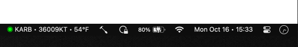

# MetarMenu

This is a [Hammerspoon](https://www.hammerspoon.org/)
[Spoon](https://www.hammerspoon.org/Spoons/) for displaying METAR reports from
[AviationWeather.gov](https://aviationweather.gov/).



## Instructions

  - Install [Hammerspoon](https://www.hammerspoon.org/go/)
  - [Download MetarMenu Spoon](https://github.com/flav/MetarMenu/raw/main/Spoon/MetarMenu.spoon.zip)
  - unzip
  - double click (Hammerspoon will install it to `~/.hammerspoon/Spoons/`)
  - Activate it in `init.lua`
```lua
-- One station
hs.loadSpoon('MetarMenu'):start({stationId = 'KARB'})

-- Stations to try to use first found
hs.loadSpoon('MetarMenu'):start({stationIds = {'KARB', 'KYIP', 'KDTW'}})
```